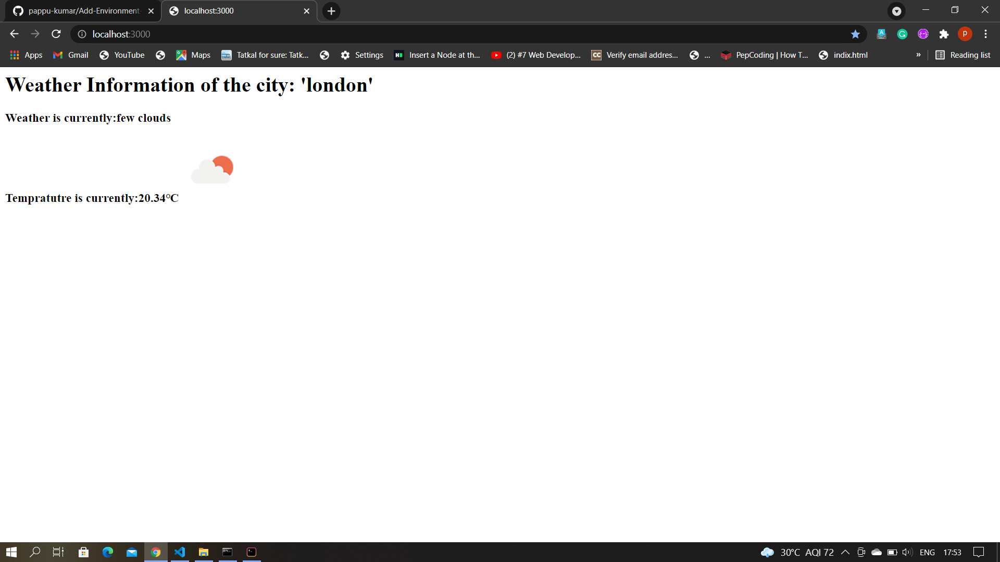

<h1> Weather-Information-Of-Any-City </h1>

<h2>Home Page:</h2>

In search bar enter the City Name whos Weather information we want to see and then it will call API and get weather information..

<h2>Weather Status:</h2>

After fatch the data from API it will show the specifc City Weather Status information

